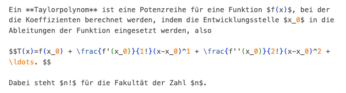

---
jupytext:
  formats: ipynb,md:myst
  text_representation:
    extension: .md
    format_name: myst
    format_version: 0.13
    jupytext_version: 1.13.8
kernelspec:
  display_name: Python 3 (ipykernel)
  language: python
  name: python3
---

```{code-cell} ipython3
:tags: [remove-input]

from IPython.display import HTML, IFrame, Image
```

# Demo Mathematik

Die folgenden Beispiele zeigen die Machbarkeit, mathematische Formeln,
YouTube-Videos, WolframAlpha, Plots und GeoGebra in das interaktive Vorlesungsskript
einzubinden.

+++

## Lernziele

```{admonition} Lernziele
:class: tip
* Einbinden von mathematischen Formeln
* Einbinden von YouTube- oder Panopto-Videos
* Einbinden von WolframAlpha
* interaktive Plots mit Plotly
* Einbinden von GeoGebra-Applets
```

+++

## Mathematische Formeln

Jupyter Book verwendet MathJax zum Einbinden von mathematischen Formeln. Die mathematischen Ausdrücke werden in LaTeX-Schreibweise notiert. Mehr Informationen finden Sie in der [Dokumentation - Math and equations](https://jupyterbook.org/en/stable/content/math.html).

Der folgende Text 




wird dann zu

---

Ein **Taylorpolynom** ist eine Potenzreihe für eine Funktion $f(x)$, bei der die Koeffizienten berechnet werden, indem die Entwicklungsstelle $x_0$ in die Ableitungen der Funktion eingesetzt werden, also

$$T(x)=f(x_0) + \frac{f'(x_0)}{1!}(x-x_0)^1 + \frac{f''(x_0)}{2!}(x-x_0)^2 + \ldots. $$

Dabei steht $n!$ für die Fakultät der Zahl $n$.

---

## Einbinden von YouTube- oder Panopto-Videos

YouTube-Videos können mit IFrames eingebunden werden:

<iframe width="560" height="315" src="https://www.youtube.com/embed/oJdN_Ics6qs" title="YouTube video player" frameborder="0" allow="accelerometer; autoplay; clipboard-write; encrypted-media; gyroscope; picture-in-picture; web-share" allowfullscreen></iframe>

Das Beispiel entstammt übrigens der E-Vorlesung "Mathematische Methoden"
der Universität Köln (siehe https://www.youtube.com/watch?v=Zsv0ylSHXYQ).

Genausogut funktioniert natürlich Panopto:

<iframe src="https://frankfurt-university.cloud.panopto.eu/Panopto/Pages/Embed.aspx?id=90fbdcfc-4183-4e1e-a7cf-af0300baf212&autoplay=false&offerviewer=true&showtitle=true&showbrand=true&captions=false&interactivity=all" height="405" width="720" style="border: 1px solid #464646;" allowfullscreen allow="autoplay"></iframe>

## WolframAlpha

Die IFrame-Technik ermöglicht es auch, WolframAlpha in das interaktive Vorlesungsskript einzubinden. Man könnte beispielsweise Studierende dazu auffordern, die Differentialgleichung

$$y'=5yx$$

mit WolframAlpha zu lösen:

```{code-cell} ipython3
:tags: [remove-input]
IFrame(src="https://www.wolframalpha.com", width=800, height=600)
```

## Interaktive Grafiken

Es ist auch möglich, [interaktive
Grafiken](https://jupyterbook.org/en/stable/interactive/interactive.html) in das
Skript einzubinden.

Beispielsweise kann die JavaScript-Bibliothek [JSXGraph](http://jsxgraph.org/wp/index.html) verwendet werden:

JSXGraph:

<script type="text/javascript" charset="UTF-8"
 src="https://cdn.jsdelivr.net/npm/jsxgraph/distrib/jsxgraphcore.js">
 </script>


<div id="jxgbox" class="jxgbox" style="width:500px; height:200px;"></div>
<script type="text/javascript">
JXG.Options.label.autoPosition = true;
JXG.Options.text.fontSize = 16;
JXG.Options.line.strokeWidth = 0.8;
var board = JXG.JSXGraph.initBoard('jxgbox', { boundingbox: [-5, 5, 5, -5], axis: true, showClearTraces: true});
var h = board.create('hyperbola', [[-Math.sqrt(2),0], [Math.sqrt(2),0], [2, Math.sqrt(3)]]);
var l1 = board.create('line', [0, 1, 1], {dash: 1});
var l2 = board.create('line', [0, -1, 1], {dash: 1});
</script>

In der folgenden Datenvisualisierung (erstellt mit
Python/[Plotly](https://plotly.com/python/)) sehen Sie als Beispiel einen
Paraboloiden

$$f(x,y) = x^2 + y^2,$$

dessen Plot sie drehen, zoomen und abspeichern können. 

```{code-cell} ipython3
:tags: [remove-input]
HTML('assets/fig_paraboloid.html')
```

## GeoGebra am Beispiel der Biegelinie

Wir betrachten als nächstes ein klassisches Beispiel eines Randwertproblems aus
der Technischen Mechanik. Ein Balken wird auf zwei Stützen gelagert und
gleichmäßig belastet. Für die Biegelinie $y(x)$, die die Auslenkung des Balkens
an jeder Position $x$ beschreibt, gilt die folgende Differentialgleichung:

$$y'' = -\frac{M_b}{EI}.$$

Die physikalischen Größen sind dabei das Biegemoment $M_b$, der
Elastizitätsmodul $E$ und das Flächenmoment $I$ des Balkenquerschnitts. Wirkt
eine konstante Streckenlast $q$ auf den Balken, so ist das Biegemoment

$$M_b(x) = \frac{1}{2}q(lx-x^2).$$

abhängig von der Position $x$ und die Differentialgleichung lautet

$$y'' = - \frac{q}{2EI}(lx-x^2).$$

Die spezielle Lösung der Differentialgleichung für die Biegelinie lautet

$$y(x)=\frac{q}{24 EI}\left(x^4 -2lx^3 + l^3x\right).$$

Typische Biegesteifigkeiten für einen Vollstab mit 1 cm Durchmesser sind in der
folgenden Tabelle gegeben:

| Material | Biegesteifigkeit [N/m$^2$] |
| :--- | ---: |
| Aluminium   | 34    |
| Hartgummi    | 2    |
| Polypropylen | 1    |

```{admonition} Mini-Übung
:class: miniexercise
Wählen Sie eine Streckenlast von $q=1 \frac{\text{N}}{\text{m}}$ und eine Balkenlänge von $l = 1 \text{m}$. Was führt zu einer größeren Durchbiegung? Verdopplung der Streckenlast oder Verdopplung der Balkenlänge?

Überprüfen Sie Ihre Vermutung in dem folgenden GeoGebra-Applet, indem Sie die Schieberegeler für die Streckenlast $q$ und die Balkenlänge $l$ variieren.
```

```{code-cell} ipython3
:tags: [remove-input]
IFrame(src="https://www.geogebra.org/calculator/mzysb6qe?embed", width=600, height=400)
```

